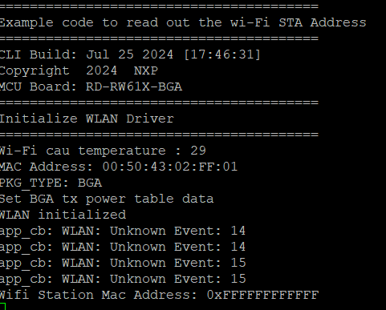

# EVK-IRIS-W1

This README provides instructions for setting up, building, and running the application using MCUXpresso IDE with the latest SDK.

## Required Tools

**Install MCUXpresso IDE**: Ensure that MCUXpresso IDE is installed on your system. If not, download and install it from the official [NXP website](https://www.nxp.com/design/design-center/software/development-software/mcuxpresso-software-and-tools-/mcuxpresso-integrated-development-environment-ide:MCUXpresso-IDE).

**Download SDK**: Download the latest [SDK](https://mcuxpresso.nxp.com/en/welcome) (current version: 2.15.0) from the NXP website and install it in MCUXpresso IDE.

**J-Link**: Download the J-Link software from Segger [here](https://www.segger.com/downloads/jlink/).

## Instructions for Building and Flashing the Application on EVK-IRIS-W1

1. **Example Project**:
   - Import the example (hello_world/FreeRTOS/wifi_cli) into your MCUXpresso IDE project.
   
2. **Update Pre-Setup Requirements**:
   - Check [this section](#pre-setup-requirement) to set up flash configuration. (if you have updated flash config files in SDK, then ignore)

3. **Build the Application**:
   - Follow the standard build procedure in MCUXpresso IDE.

4. **Connect EVK to PC**:
   - Connect your EVK (Evaluation Kit) to your PC using a USB-C cable.

5. **Debugging**:
   - Use debug mode in MCUXpresso IDE to flash the application onto the EVK.
   - The application will start at the main function. Use the play button to run the application.

## Flashing Firmware

When using WiFi/BT applications, you need to flash the WiFi/BT Firmware separately from the application.

### Flashing WiFi/BT Firmware

   you can find the latest Radio Firmware in the SDK as well    
   
   ```sh
            ex. Wi-Fi Firmware location path ->  \rdrw612bga_wifi_cli\component\conn_fwloader\fw_bin
   ```

**Using J-Link Lite Tool**:

   - Use the J-Link Lite tool to flash the WiFi/BT Firmware.
   - **WiFi**: Flash `rw610_sb_wifi_vXX.bin` at address `0x08400000` using J-Link Lite.
   - **Bluetooth**: Flash `rw61x_sb_ble_aXX.bin` at address `0x08540000` using J-Link Lite.

**NOTE:** The WiFi/BT Firmware version depends on the chipset variant. Please use the appropriate version (e.g., a1 chipset -> XXXXXX_a1.bin). 

   ```sh
Use j-link commander to identify the chipset variant, follow the  setups

J-Link> con
Device> RW610
TIF>S
Speed><Enter>
J-Link > mem32 45001114 1

Below is the hexadecimal representation of the chipset variant.
A0 : 0x7000
A1 : 0x7001
A2 : 0x7002

   ```


### Flashing Application Firmware

**Flashing the Application**:
   - After flashing the WiFi/BT Firmware, you can flash the application Firmware using the [same method mentioned above](#instructions-for-building-and-flashing-the-application-on-evk-iris-w1).
   - Alternatively, pre-built application Firmware can be downloaded from GitHub and flashed using J-Link Lite.

## Pre-Setup Requirement

Use the **flash_config.c** file from [this location](https://github.com/u-blox/u-blox-sho-OpenCPU/tree/master/MCUXpresso/IRIS-W1/sw_config/flash_config) as per the density and vendor preset on IRIS-W1 EVK.

1. **Replacing Flash Config File**:
     - Replace the **flash_config.c** file located at **SDK_2_xx_xxx_RD-RW612-BGA.zip\boards\rdrw612bga\flash_config\flash_config.c** in the SDK.
2. **Replacing MFlash Config File**: 
     - Replace the **mflash_drv.c** file located at **SDK_2_xx_xxx_RD-RW612-BGA.zip\components\flash\mflash\rdrw612bga\mflash_drv.c** in the SDK.
3. **Replacing wifi_cal_data File**: 
     - Replace the **wifi_cal_data_ext.h** file located at **SDK_2_xx_xxx_RD-RW612-BGA.zip\middleware\wifi_nxp\incl\wifi_cal_data_ext.h** in the example.
4. **Replacing bt_Calibration File**: 
     - Replace the **fwk_config.h** file located at **D:\SDK_2_15_000_RD-RW612-BGA.zip\middleware\wireless\framework\platform\rw61x\configs** in the example.
     - Replace the **fwk_platform_ble.c** file located at **D:\SDK_2_15_000_RD-RW612-BGA.zip\middleware\wireless\framework\platform\rw61x** in the example.
   

## Obtaining Device Identifiers (Serial Number, Module Type, MAC Address)

When developing an application that requires access to the serial number, module type number, or MAC address of a device :

- To retrieve the module's Type Number and Serial Number using the romapi OTP APIs, follow these steps:

- Type Number: Read from E-Fuse IDs 305-312.
- Serial Number: Read from E-Fuse IDs 313-316.

Both values are programmed during production.

### Type and Serial Number

- To quickly verify the module's Type and Serial Numbers:

1. Navigate to the file:
	**SDK_2_16_000_RD-RW612-BGA/boards/rdrw612bga/driver_examples/romapi/otp/main.c**
2. Replace the existing code with the provided code.[readOTP](https://github.com/u-blox/u-blox-sho-OpenCPU/tree/master/MCUXpresso/IRIS-W1/EVK-IRIS-W1/examples/Fidelex_8MB)
3. Compile the demo application.
4. Flash the compiled application onto the module.
5. Press the reset button to display the Type Number and Serial Number via the UART Serial Console.


- To retrieve the module's Wi-Fi STA MAC Address, follow these steps using the provided APIs:

- Initialize the Wi-Fi driver with the wlan_init(wlan_fw_bin, wlan_fw_bin_len) API.
- Enable WLAN RF test mode using the wlan_set_rf_test_mode() API.
- Read the Wi-Fi STA MAC Address via the wlan_get_rf_otp_mac_addr() API.

### MAC address

**First Method**

 To quickly verify the module's Wi-Fi STA MAC Address:

1. Navigate to the file:
	SDK_2_16_000_RD-RW612-BGA/boards/rdrw612bga/wifi_examples/wifi_test_mode/main.c
2. Replace the existing code with the provided code.[readMAC](https://github.com/u-blox/u-blox-sho-OpenCPU/tree/master/MCUXpresso/IRIS-W1/EVK-IRIS-W1/examples/Fidelex_8MB)
3. Compile the demo application.
4. Flash the compiled application onto the module along with the rw61x_sb_wifi_a2.bin binary at address 0x08400000.
5. Press the reset button to display the Wi-Fi STA MAC Address on the UART Serial Console.

**NOTE** For more detailed information on the Wi-Fi Test Mode Application, refer to the UM11799-NXP-Wi-Fi-and-Bluetooth-Demo-Applications-for-RW61x.pdf document located at:
	**SDK_2_16_000_RD-RW612-BGA/docs/wireless**



**Second Method**

Alternatively, you can use the existing Wi-Fi Test Mode Application in the SDK to read the Wi-Fi STA MAC Address:

1. Navigate to:
	SDK_2_16_000_RD-RW612-BGA/boards/rdrw612bga/wifi_examples/wifi_test_mode
2. Compile the Wi-Fi Test Mode Application.
3. Flash the application onto the module along with the rw61x_sb_wifi_a2.bin binary at address 0x08400000.
4. Press the reset button to view the Wi-Fi Test Mode logs on the console.
5. Enter the following commands, one after the other:
	wlan-set-rf-test-mode
	wlan-get-rf-otp-mac-addr
6. This will display the written Wi-Fi STA MAC Address.
  

- **NOTE** this precompiled binary is only for Fidelex memory boards.

## Recovery of IRIS-W1

If you face any issues with IRIS-W1 and can't perform any operations, it might be in an unknown state. Use the blhost application to reset it. Find more information on [this page](https://github.com/u-blox/u-blox-sho-OpenCPU/tree/master/MCUXpresso/IRIS-W1/tools/blhost).

## Note

If you encounter any issues or have further questions, please refer to the documentation or contact the support team for assistance.
