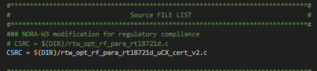

# u-blox NORA-W30 openCPU output power settings

1. Add the file **rtw_opt_rf_para_rtl8721d_uCX_cert_v2.c** to the SDK folder: 
**{SDK Base}/component/common/drivers/wlan/realtek/src/core/option/** 
Include the file in the build, and remove the default file.

2. For a GCC build of the Realtek example project: 
**{SDK Base}/project/realtek_amebaD_va0_example/GCC-RELEASE/project_hp/asdk/make/wlan/option/Makefile** 
Comment out:  **CSRC = $(DIR)/rtw_opt_rf_para_rtl8721d.c** 
Added in place of: **CSRC = $(DIR)/rtw_opt_rf_para_rtl8721d_uCX_cert_v2.c**

